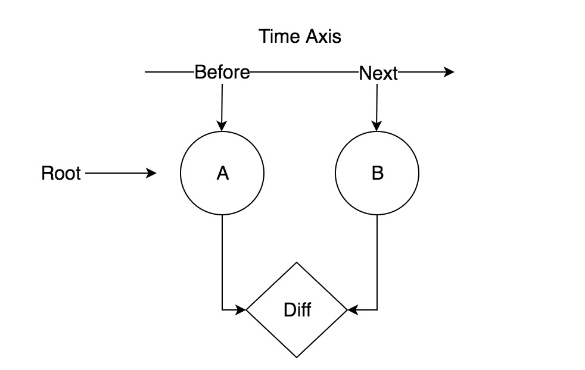
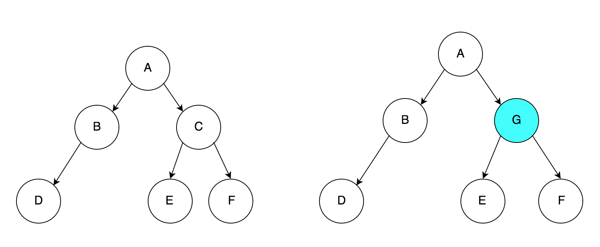
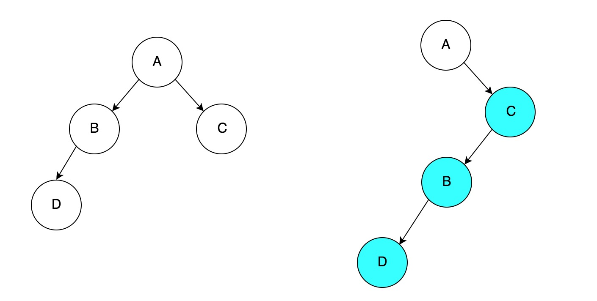

## § 2.4 React的Diff算法

### § 2.4.1 Intro

​    关于**React**, 估计所有开发者一听到或者一说到React想到的都是它的**Diff**, **Diff**这个东西确实是**React**的一个非常大的特点之一, 而且是整套框架的核心内容之一, 加之**virtualDOM**这一特性加持, 使得**React**的这套**Diff** + **virtualDOM**, 得以在前端领域有这样高的地位.

​    **Tree Diff**算法实际上并不是由**React**引入的, 但是为何**React**的**Diff**会如此名声在外? 由于**React**将传统**O(n^3)**的时间复杂度给下降到了**O(n)**的时间复杂度. 试想一下, 如果是按照传统的时间复杂度, <u>**100**</u>个节点可就是**<u>1000000</u>**次的比较, 而**React**的**Diff**算法只需要**<u>100</u>**次, 对于客户端来说, **O(n^3)**的时间复杂度的**Diff**显然是不可接受的(再加之JS的运行速度并不比得上更底层的语言).


### § 2.4.2 React Tree Diff 与传统 Diff 的不同之处

​    策略: 

> * Web UI 中 DOM 节点跨层级的移动操作特别少，可以忽略不计
> * 拥有相同类的两个组件将会生成相似的树形结构，拥有不同类的两个组件将会生成不同的树形结构
> * 对于同一层级的一组子节点，它们可以通过唯一 id 进行区分

​    基于以上三个点, 所以整个**Tree Diff** 可以用很简单的方法来实现

#### 1) 对于上下层级关系来比对: 

* ##### 当做**Diff**的时候, **React**会首先比对前后时间根节点的**Elements** 



```jsx
<!-- Elements Of Different Types -->
<!-- Before -->
<div>
  <Counter/>
</div>

<!-- After --> 

<span>
  <Counter/>
</span>

<!-- Seperator --> 

div.destory();
Counter.destory();
let span = new Span();
let counter = new Counter();
span.append(counter)
```

​    像上述情况, 虽然`Counter`并没有经历任何变动, 但是它的父节点从`div`变成了`span`, 所以`Counter`会先被卸载之后再被挂载进新的父节点中.

​    关于**React**的**DOM Tree**的**Diff**: (PS: 相同颜色的节点进行比较)



​    React的比对策略, 同级与同级比对, 如果比对结果为**false**, 那么由这个节点将被卸载之后重新**mount**进**DOM Tree.** 

​    比如: 



​    按照常规 Diff 的方法

```typescript
// 伪代码
A.removeChild(B);
C.appendChild(B);
```

​    React的Diff策略算法: 

```typescript
// Unmounting phase
A.removeChild(B);
B.destory();
D.destory();
// Re-mounting phase
let newB = new BComponent();
C.appendChild(newB.appendChild(new DComponent()));
```

​    根据这个过程, 再结合之前生命周期, 可以得出以下调用栈: (如果感兴趣可以去自己尝试在代码里做实验, 给生命周期函数里加上log, 来观察具体调用栈)

```typescript
// interaction trigger update
A.componentWillUpdate();

B.ComponentWillUnmount();
D.ComponentWillUnmount();

C.componentWillUpdate();
new newB();
newB.componentWillMount();
new newD();
newD.componentWillMount();
newD.componentDidMount();
newB.componentDidMount();

C.componentDidUpdate();
A.componentDidUpdate();
// update over
```

我写了一个例子: [Example.js](./Example.js), 通过例子的运行结果可以看到以下log

```javascript
A created
A Will Mount
B created
B Will Mount
D created
D Will Mount
C created
C Will Mount
D Did Mount
B Did Mount
C Did Mount
A Did Mount
=====================
A Will Update
B Will Unmount
D Will Unmount
C created
C Will Mount
B created
B Will Mount
D created
D Will Mount
C Will Unmount
D Did Mount
B Did Mount
C Did Mount
A Did Update
```


#### 2) 对于同级关系比对:

#####   1. 相同类型的DOM元素的比对(DOM Elements Of The Same Type) :

```jsx
<div className="before" title="stuff" />

<div className="after" title="stuff" />
```

​    在之前生命周期的一部分说到过, 所有的props都会被拉出来放到一个`props`对象当中保存, 当做比对的时候, 在这个例子里的变化`className`会被标记为需要改变的`props` , **React**便会只去更新这个属性

```typescript

```


#####  2. 